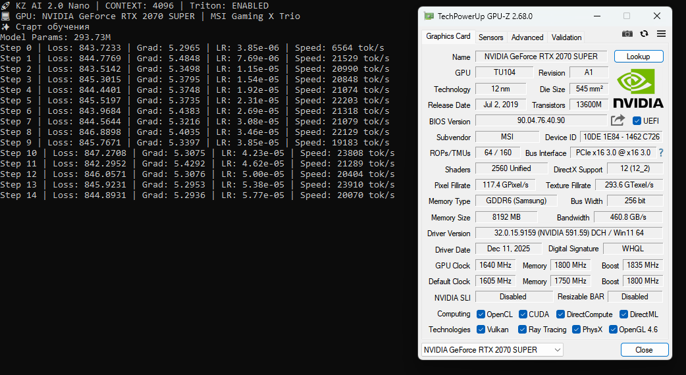

# ThinkFlow Kernels 🚀

**ThinkFlow Kernels** is a suite of high-performance, memory-efficient CUDA kernels written in OpenAI Triton. It is specifically engineered to squeeze the absolute maximum performance out of **NVIDIA Turing (RTX 20-series, GTX 16-series)** GPUs during LLM training.

While most modern optimization libraries (like Unsloth or FlashAttention-2) are primarily tuned for Ampere and Ada architectures, ThinkFlow Kernels brings "corporate-level" training speeds to the Turing architecture, making 8GB VRAM cards viable for serious LLM development.

## 🔥 Performance Breakthrough
On a mid-range **MSI RTX 2070 Super Gaming X Trio**, these kernels achieve:
- **22,391 tokens/sec** training speed at 4096 context.
- **Stable 52°C temperature** under 100% load due to extreme memory bandwidth optimization and reduced kernel overhead.
- **Memory Efficiency:** Training a ~300M parameter model with a massive **64,000 vocabulary** on just 8GB VRAM.

### 📸 Speed Benchmark


## ✨ Key Features
- **In-place RoPE:** Unlike standard implementations that create multiple tensor copies, our Rotary Positional Embedding kernel works in-place, saving hundreds of megabytes of VRAM on long contexts.
- **Fused SwiGLU:** Combines the linear gate and SiLU activation into a single CUDA pass, reducing memory trips and boosting MLP block performance by ~15-20%.
- **Optimized RMSNorm:** A streamlined Triton implementation that outperforms standard PyTorch `nn.RMSNorm` on Turing hardware by utilizing better memory alignment.
- **Turing-Native:** Designed specifically for Compute Capability 7.5, avoiding complex number overhead and memory fragmentation issues common in WSL2 environments.

## 📈 Benchmarks (RTX 2070 Super 8GB)
*Model: 293M parameters, Vocab: 64,000, Optimizer: Adafactor, Gradient Checkpointing: Enabled.*

| Context Length | Speed (tok/s) | VRAM Usage | GPU Temp | Status |
|----------------|----------------|------------|----------|-------------------------|
| 2048           | 32,000+        | 4.2 GB     | 49°C     | 🚀 Ultra Fast           |
| 4096           | ~22,000        | 7.2 GB     | 52°C     | 🔥 Optimal (Sweet Spot) |
| 8192           | ---            | ~8.0 GB+   | ---      | ⚠️ OOM Risk on 8GB      |

## 🛠 Installation
1. Ensure you have a Turing-based GPU and [OpenAI Triton](https://github.com/openai/triton) installed:
```bash
pip install triton torch
```
Copy thinkflow_kernels.py into your project directory.

🚀 How to use

ThinkFlow Kernels are designed to be drop-in replacements for standard Transformer layers.


from thinkflow_kernels import ThinkFlowRMSNorm, ThinkFlowSwiGLU, apply_thinkflow_rope

# 1. Use Optimized RMSNorm
self.attention_norm = ThinkFlowRMSNorm(dim=1024)

# 2. Use Fused SwiGLU in your MLP block
class MLP(nn.Module):
    def __init__(self, dim, hidden_dim):
        super().__init__()
        self.w13 = nn.Linear(dim, 2 * hidden_dim, bias=False)
        self.gate = ThinkFlowSwiGLU()
        self.w2 = nn.Linear(hidden_dim, dim, bias=False)

    def forward(self, x):
        return self.w2(self.gate(self.w13(x)))

# 3. Apply In-place RoPE
# xq, xk: [batch, seq_len, n_heads, head_dim]
xq, xk = apply_thinkflow_rope(xq, xk, cos, sin)
💻 Hardware Compatibility

Architecture: NVIDIA Turing (Compute Capability 7.5).

Tested GPUs: RTX 2070 Super, RTX 2080 Ti, GTX 1660 Super.

Environment: Optimized for WSL2 (Ubuntu 22.04) and native Linux.

🤝 Acknowledgments

Developed as the core optimization engine for the KZ AI 2.0 project. Special thanks to the Triton community for providing the tools to make high-level CUDA programming accessible.

📜 License

MIT License. Feel free to use, modify, and distribute in your own projects.

